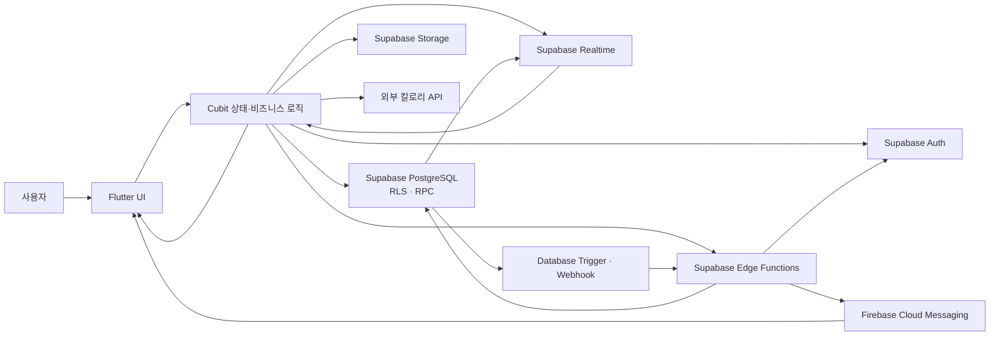
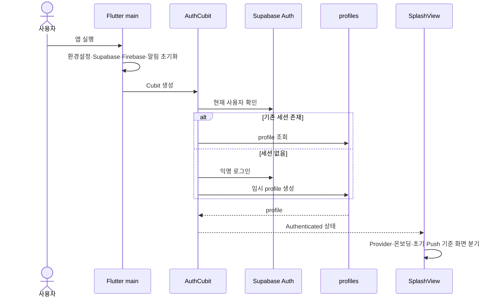
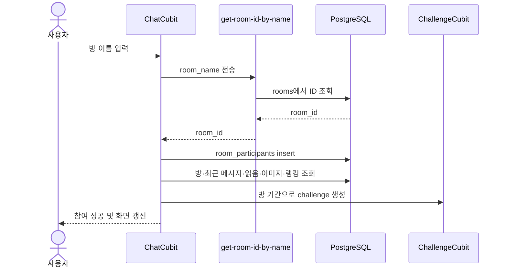
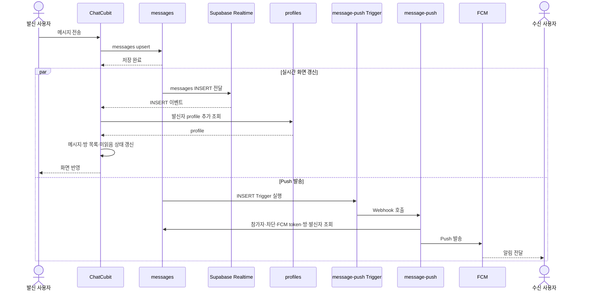
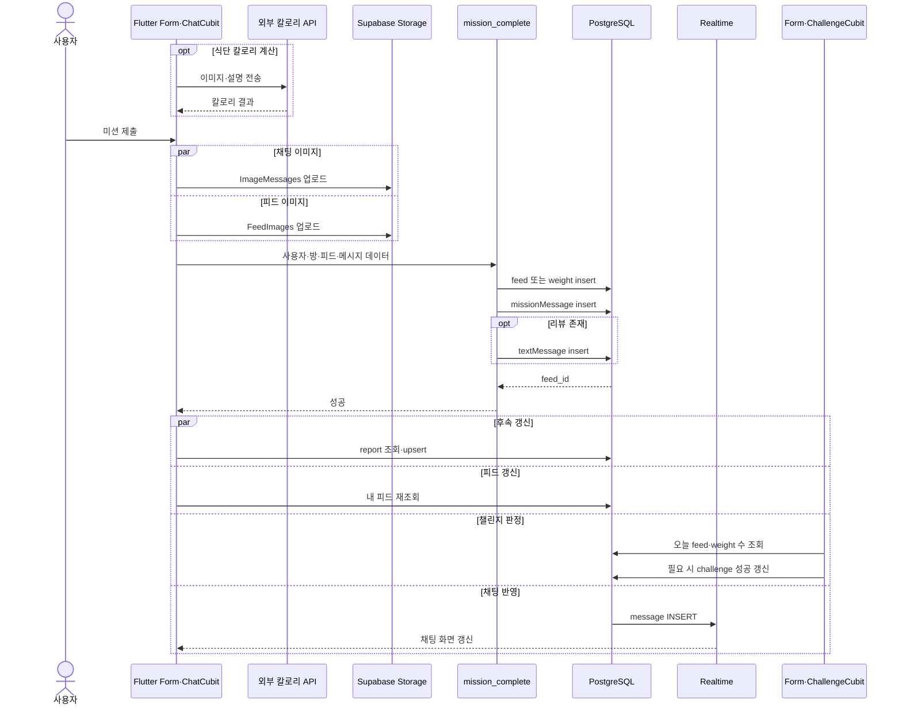

# Udaadaa AS-IS Architecture

## 1. 문서 목적

이 문서는 현재 Udaadaa의 구성 요소가 실제 기능을 처리하는 순서와 데이터 변경 경계를 설명한다. Inventory가 존재하는 기능과 자원을 목록화했다면, 이 문서는 각 자원이 어떻게 연결되어 사용자 결과를 만드는지 정의한다.

이 문서의 결과는 다음 작업의 근거로 사용한다.

- Flutter에서 Spring으로 이전할 책임 선정
- 도메인과 모듈 경계 결정
- 기존 동작을 유지해야 하는 호환성 기준 정의
- 부분 실패, 지연과 권한 위험의 개선 범위 결정
- 기능별 마이그레이션 순서와 완료 기준 정의

## 2. 조사 기준과 범위

### 근거

- Flutter 화면, Cubit과 모델의 실제 호출 코드
- Supabase migration과 Edge Function 코드
- 2026-07-27에 읽기 전용으로 확인한 배포 DB, Realtime, Storage, Trigger와 Edge Function 메타데이터
- [System Inventory](01-system-inventory.md)

### 표현 원칙

- **확인:** 코드 또는 배포 메타데이터에서 직접 확인한 동작
- **추론:** 확인된 동작을 바탕으로 예상되는 영향이며 런타임 검증이 필요한 내용
- 실제 사용자 데이터, 로그, 키와 토큰 값은 조사하거나 기록하지 않는다.
- TO-BE 구조와 Spring 구현 방식은 이 문서에서 확정하지 않는다.

### 핵심 분석 대상

- 앱 실행과 인증
- 초기 채팅 데이터 로딩
- 채팅방 검색과 참여
- 메시지 전송, Realtime 수신과 화면 갱신
- 이미지 메시지, 읽음, 반응과 차단
- 미션 인증, 리포트와 챌린지 갱신
- 피드 반응과 Push 알림
- 회원 탈퇴

## 3. 전체 시스템 구조



현재 구조의 중심은 별도 애플리케이션 서버가 아니라 Flutter의 Cubit이다. Cubit이 인증 상태, 데이터 조회·쓰기, 비즈니스 계산, Realtime 이벤트 처리와 UI 상태 갱신을 함께 담당한다.

## 4. 구성 요소별 현재 책임

| 구성 요소 | 현재 책임 | 주요 근거 |
|---|---|---|
| Flutter View | 사용자 입력, 화면 이동, Cubit 상태에 따른 화면 갱신 | `udaadaa/lib/view/` |
| `AuthCubit` | 로그인, 프로필 생성·조회, FCM token, 로그아웃과 탈퇴 순서 제어 | `auth_cubit.dart` |
| `ChatCubit` | 초기 채팅 로딩, 방 참여, 메시지·읽음·반응·차단, Realtime과 Push 진입 처리 | `chat_cubit.dart` |
| `FormCubit` | 이미지 처리, 칼로리 API, 리포트 갱신과 폼 상태 | `form_cubit.dart` |
| `ChallengeCubit` | 미션 수 계산, 연속 성공과 챌린지 종료 판정 | `challenge_cubit.dart` |
| `FeedCubit` | 피드 조회·반응·차단·삭제와 리포트 보정 | `feed_cubit.dart` |
| Supabase Auth | 익명·이메일·Apple·Kakao 인증과 세션 | 배포 Auth, `AuthCubit` |
| PostgreSQL·RLS | 데이터 원본, 접근 제어와 `mission_complete` 트랜잭션 | migration, 배포 DB |
| Realtime | 채팅 관련 DB 변경을 Flutter에 전달 | publication, `ChatCubit.setChatEventsListener` |
| Storage | 피드·미션·채팅 이미지 저장과 public URL 제공 | `FeedImages`, `ImageMessages`, `fallback-images` |
| Edge Function | 초기 채팅 집계, 방 검색, Auth 사용자 삭제와 Push 발송 | `udaadaa/supabase/functions/` |
| Firebase | 채팅·피드 반응 Push 전달 | Push Edge Function, Flutter Firebase Messaging |
| SharedPreferences | 온보딩·튜토리얼과 일부 로컬 설정 보존 | `service/shared_preferences.dart` |
| 분석 SDK | 사용자 행동과 오류 이벤트 전송 | `utils/analytics/`, 각 Cubit의 이벤트 호출 |

로컬 설정과 분석은 핵심 데이터의 최종 원본이 아니다. 온보딩 완료 여부와 로컬 알림 상태는 기기에 남고, Firebase Analytics·Mixpanel·Amplitude·Facebook App Events로 보내는 분석 이벤트는 여러 Flutter 코드에 분산되어 있다.

## 5. 앱 실행과 인증 흐름

### 처리 순서



### 현재 동작

- 앱은 Supabase, Firebase, 로컬 알림과 설정 초기화를 `Future.wait`로 수행한 뒤 UI를 시작한다.
- `AuthCubit`은 현재 세션이 있으면 `profiles`를 조회하고, 없으면 익명 로그인 후 임시 프로필을 생성한다.
- Supabase 인증 상태 변경을 구독하여 소셜·이메일 로그인 후 프로필을 조회하거나 생성한다.
- `SplashView`는 인증 Provider, 온보딩 완료 상태와 앱을 연 Push 데이터에 따라 로그인·온보딩·메인 화면으로 이동한다.
- 프로필과 인증 사용자는 서로 다른 단계에서 생성되므로 한 단계만 성공하는 부분 실패 가능성이 있다.

### 코드 근거

- 초기화와 Cubit 구성: `udaadaa/lib/main.dart:42`, `:70`
- 세션·익명 로그인·프로필 생성: `udaadaa/lib/cubit/auth_cubit.dart:18`, `:81`
- 인증 후 화면 분기: `udaadaa/lib/view/splash_view.dart:26`, `:76`

## 6. 초기 채팅 데이터 로딩

### 처리 순서

```text
AuthCubit이 Authenticated 상태 발생
→ ChatCubit._initialize 실행
→ INITIAL_CHAT_END_POINT로 userId 전송
→ 초기 채팅 Edge Function이 service role로 여러 테이블 조회
→ 방 목록·최근 메시지·읽음·차단·미읽음·이미지 메시지 반환
→ ChatCubit의 메모리 Map과 List 구성
→ Realtime 채널 구독 시작
→ ChatMessageLoaded 상태로 화면 갱신
```

### 현재 동작

- `ChatCubit`은 생성 시 인증 상태를 확인하고 이후 `AuthCubit` 상태도 구독한다.
- 초기 데이터는 Supabase Flutter SDK의 개별 조회가 아니라 환경변수의 HTTP endpoint에서 한 번에 받는다.
- Edge Function은 차단 사용자·메시지, 방 참가자, 방, 프로필, 메시지, 읽음과 반응을 집계한다.
- Flutter는 응답을 `chatList`, `messages`, `imageMessages`, `readReceipts`, `unreadMessages` 등 여러 로컬 컬렉션에 나누어 저장한다.
- 초기 HTTP 요청이 실패해도 다음 단계에서 Realtime 구독은 시도되지만, 기존 메시지와 방 목록이 비어 있을 수 있다.
- 실제 endpoint가 production Function인지 별도 endpoint인지는 환경변수 값이 없어 확정되지 않았다.

### 코드 근거

- 인증 상태와 초기화 연결: `udaadaa/lib/cubit/chat_cubit.dart:67`
- 초기 HTTP 요청: `udaadaa/lib/cubit/chat_cubit.dart:119`
- 응답 변환과 Realtime 시작: `udaadaa/lib/cubit/chat_cubit.dart:150`, `:387`
- 초기 채팅 Function: `udaadaa/supabase/functions/post-initial-chat-data/index.ts`

## 7. 채팅방 검색과 참여 흐름



### 실패 경계

- 방 참가 레코드 저장 후 초기 데이터 조회 또는 챌린지 생성이 실패할 수 있다.
- 챌린지 생성 실패 시 참가 레코드 삭제를 시도하지만 해당 삭제를 기다리거나 실패를 검증하지 않는다.
- 이미 참가한 방과 다른 실패가 같은 사용자 메시지로 처리될 수 있다.
- 방 생성·관리 주체는 현재 저장소에서 확인되지 않았다.

### 코드 근거

- 방 이름 검색: `udaadaa/lib/cubit/chat_cubit.dart:1420`
- 참가와 후속 초기화: `udaadaa/lib/cubit/chat_cubit.dart:1460`
- 방 검색 Function: `udaadaa/supabase/functions/get-room-id-by-name/index.ts`

## 8. 텍스트 메시지 전송과 수신 흐름



### 화면 갱신 기준

- `sendMessage`는 DB 저장 후 메시지를 로컬 목록에 직접 추가하지 않는다.
- 발신자 화면도 Realtime의 `messages INSERT` 이벤트를 받아야 메시지가 추가된다.
- INSERT callback은 발신자 프로필을 추가 조회한 뒤 메시지와 채팅방 목록을 갱신하고 마지막에 `ChatMessageLoaded`를 emit한다.
- 현재 방의 메시지라면 읽음 레코드를 추가하고, 다른 방이면 로컬 미읽음 수를 증가시킨다.
- Realtime 구독에는 연결 성공·실패 상태 callback이 없어 구독 준비 여부를 화면이 알 수 없다.

### 지연 가능 구간

```text
DB upsert
→ Realtime 이벤트 전달
→ 발신자 profile 추가 조회
→ 이미지인 경우 URL 처리
→ 로컬 정렬·미읽음 계산
→ UI emit
```

따라서 사용자가 느끼는 전송 지연은 Supabase 하나의 응답 시간만이 아니라 DB 쓰기, Realtime 수신, 추가 profile 조회와 Flutter 상태 갱신 전체의 합이다. 이는 코드로 확인한 경로에 따른 추론이며 실제 구간별 시간은 계측이 필요하다.

### 코드 근거

- 메시지 저장: `udaadaa/lib/cubit/chat_cubit.dart:1793`
- Realtime 처리: `udaadaa/lib/cubit/chat_cubit.dart:1174`
- 배포 Trigger: `messages`의 `message-push` AFTER INSERT
- Push Function: `udaadaa/supabase/functions/message-push/index.ts`

## 9. 채팅 부가 기능 흐름

### 이미지 메시지

```text
이미지 선택
→ Flutter에서 압축
→ ImageMessages Storage 업로드, 실패 시 최대 3회 시도
→ 업로드된 경로로 messages upsert
→ Realtime INSERT 수신
→ public URL 생성 후 화면 반영
```

- 여러 이미지는 순차적으로 압축·업로드하고 각 이미지마다 메시지를 저장한다.
- Storage 업로드 후 메시지 저장이 실패하면 업로드 파일을 제거하는 보상 로직이 없다.
- 근거: `chat_cubit.dart:1832`, `:1903`, `:1962`

### 읽음 처리

```text
채팅방 진입
→ 로컬 미읽음 message ID 수집·중복 제거
→ read_receipts upsert, 실패 시 최대 3회 시도
→ 로컬 메시지와 미읽음 수 갱신
→ Realtime INSERT로 다른 참여자의 읽음 상태 갱신
```

- DB 읽음 저장이 최종 실패해도 로컬 처리는 계속될 수 있어 서버와 화면이 일시적으로 달라질 수 있다.
- 근거: `chat_cubit.dart:1501`, `:1991`

### 반응과 차단

- 메시지 반응은 `chat_reactions`에 upsert하고 Realtime INSERT로 각 클라이언트 메시지를 갱신한다.
- 사용자 차단과 메시지 차단은 각각 DB upsert 후 Flutter 메모리 목록에서 즉시 제거한다.
- 차단은 이후 초기 채팅 집계와 Push 수신자 필터에도 사용된다.
- 근거: `chat_cubit.dart:2007`, `:2027`, `:2046`

## 10. 미션 인증과 챌린지 흐름



### 트랜잭션 경계

- `mission_complete` 내부의 feed 또는 weight와 메시지 생성은 하나의 DB 트랜잭션이다.
- 두 Storage 업로드, `report` 갱신과 챌린지 재계산은 RPC 트랜잭션 밖에 있다.
- RPC 실패 시 이미 업로드한 두 이미지가 남을 수 있다.
- RPC 성공 후 `report` 갱신이 실패하면 피드·메시지는 존재하지만 리포트 값은 반영되지 않을 수 있다.
- `FormCubit.missionComplete`는 `updateReport` 완료를 기다리지 않으며 `ChatCubit`도 챌린지 재계산을 별도로 실행한다.
- 배포 `mission_complete`는 호출자가 전달한 사용자와 방을 내부에서 검증하지 않는 보안 위험이 있다.

### 현재 챌린지 규칙

- 하루에 운동을 제외한 feed 2개 이상과 weight 1개 이상이면 해당 일자의 미션 완료로 본다.
- 연속 완료 일수와 종료일 조건을 만족하면 `challenge.is_success`를 갱신한다.
- 이 규칙은 `ChallengeCubit`의 클라이언트 계산으로 수행된다.

### 코드 근거

- 미션 전체 제어: `udaadaa/lib/cubit/chat_cubit.dart:2085`
- RPC 호출: `udaadaa/lib/cubit/chat_cubit.dart:2153`
- 리포트 갱신: `udaadaa/lib/cubit/form_cubit.dart:217`, `:326`
- 챌린지 판정: `udaadaa/lib/cubit/challenge_cubit.dart:411`, `:463`
- RPC 정의: `udaadaa/supabase/migrations/20250517093610_mission_complete_function_update.sql`

## 11. 피드 반응과 Push 흐름

```text
사용자가 피드 반응 선택
→ FeedCubit이 reactions upsert
→ 로컬 챌린지 미션 재계산
→ reactions INSERT Trigger 실행
→ reaction-push Edge Function
→ 피드 작성자·알림 설정·FCM token·반응 사용자 조회
→ Firebase Push 발송
```

- 배포 DB의 `reactions`에는 `reaction-push`와 `my_webhook` 두 AFTER INSERT Trigger가 있다.
- 두 Trigger의 endpoint와 실제 중복 알림 여부는 확인되지 않았다.
- 피드 삭제는 리포트 값을 먼저 계산·upsert한 뒤 feed를 삭제하므로 두 단계 중 하나만 성공할 수 있다.
- 근거: `feed_cubit.dart:676`, `:759`, `supabase/functions/reaction-push/index.ts`

## 12. 회원 탈퇴 흐름

```text
현재 사용자 확인
→ profiles 삭제
→ FK cascade로 서비스 데이터 삭제
→ delete-auth-user Edge Function 호출
→ Auth admin 사용자 삭제
→ Flutter signOut과 상태 초기화
```

### 실패 경계

- 서비스 데이터 삭제와 Auth 사용자 삭제는 하나의 트랜잭션이 아니다.
- 프로필 삭제 후 Edge Function이 실패하면 Auth 사용자만 남을 수 있다.
- 배포 Function은 유효한 JWT를 요구하지만 요청 본문 `userId`와 JWT 주체 비교는 저장소 코드에서 확인되지 않았다.
- 근거: `udaadaa/lib/cubit/auth_cubit.dart:557`, `udaadaa/supabase/functions/delete-auth-user/index.ts`

## 13. 주요 데이터 쓰기 주체

| 데이터 | 현재 쓰기 주체 | 변경 후 화면 반영 | 원자성 범위 |
|---|---|---|---|
| `profiles` | `AuthCubit` | AuthCubit 상태 | Auth 사용자와 별도 |
| `room_participants` | `ChatCubit` | 후속 전체 조회 | 챌린지 생성과 별도 |
| `messages` | `ChatCubit`, `mission_complete` | Realtime 수신 후 | 단일 쓰기 또는 RPC 내부 |
| `read_receipts` | `ChatCubit` | 로컬 선반영·Realtime | 단일 upsert |
| `chat_reactions` | `ChatCubit` | Realtime 수신 후 | 단일 upsert |
| `feed`, `weight` | `mission_complete`, 일부 Cubit | 재조회 또는 Cubit 상태 | RPC 사용 시 메시지와 원자적 |
| `report` | `FormCubit`, `FeedCubit` | ProfileCubit 재조회 | 피드·미션과 별도 |
| `challenge` | `ChallengeCubit` | Cubit 상태 | 미션 데이터와 별도 |
| Storage 객체 | `FormCubit`, `ChatCubit` | DB 경로와 public URL | DB 쓰기와 별도 |

## 14. 현재 실패·지연 경계 요약

| ID | 구간 | 현재 처리 | 영향 |
|---|---|---|---|
| AS-01 | 앱 초기화 | 여러 SDK를 `Future.wait`로 초기화 | 하나의 실패가 앱 시작에 영향 가능 |
| AS-02 | 초기 채팅 HTTP | 실패를 로그로 남기고 Realtime 구독 시도 | 기존 방·메시지 없이 이벤트만 받을 수 있음 |
| AS-03 | 메시지 전송 | DB 저장 후 Realtime을 기다려 UI 갱신 | 연결 지연이 사용자 전송 지연으로 보임 |
| AS-04 | Realtime INSERT | profile 추가 조회 후 UI emit | 이벤트마다 추가 네트워크 왕복 발생 |
| AS-05 | 이미지 메시지 | Storage 후 DB 저장 | DB 실패 시 orphan 파일 가능 |
| AS-06 | 미션 인증 | Storage·RPC·report·challenge 분리 | 부분 성공과 데이터 불일치 가능 |
| AS-07 | 방 참여 | participant 후 조회·challenge 생성 | 보상 삭제까지 실패할 수 있음 |
| AS-08 | 피드 삭제 | report 보정 후 feed 삭제 | 중간 실패 시 리포트 불일치 가능 |
| AS-09 | 회원 탈퇴 | service data 후 Auth 삭제 | Auth와 서비스 데이터 분리 가능 |
| AS-10 | Push | DB Trigger·Edge Function·FCM 분리 | 전달 실패 재처리와 중복 판단 어려움 |

## 15. 마이그레이션 시 보존할 현재 동작

- 인증 후 사용자 프로필을 제공하고 온보딩 상태에 맞는 화면으로 이동한다.
- 방 참가자만 방·메시지·읽음·반응과 채팅 이미지를 조회한다.
- 메시지를 영구 저장한 뒤 모든 참여자에게 동일한 결과를 전달한다.
- 연결이 끊겼다가 복구돼도 DB를 기준으로 누락 메시지와 미읽음 상태를 복원한다.
- 차단한 사용자·메시지는 초기 조회, 실시간 화면과 Push에서 제외한다.
- 미션 제출 결과가 피드 또는 체중, 채팅, 리포트와 챌린지에 일관되게 반영된다.
- 피드 반응과 채팅 메시지의 알림 설정 및 차단 조건을 유지한다.
- 회원 탈퇴 후 Auth와 서비스 데이터가 모두 제거된다.

## 16. 후속 확인 항목

- 실제 `INITIAL_CHAT_END_POINT`와 배포 Function 버전
- Realtime 연결·재연결 상태와 메시지 단계별 소요 시간 계측
- 앱 종료·백그라운드·네트워크 전환 시 누락 복구 동작
- `reactions`의 두 Trigger endpoint와 중복 Push 여부
- 방 생성과 관리 주체
- Auth Provider, Redirect URL과 Dashboard 전용 설정
- 저장소와 배포 Edge Function 소스의 정확한 일치 여부

## 17. 다음 단계에서 사용할 결론

- Flutter Cubit이 UI 상태뿐 아니라 비즈니스 흐름과 데이터 정합성까지 담당한다.
- 채팅의 최종 원본은 PostgreSQL이지만 화면 반영은 Realtime 연결과 추가 조회에 의존한다.
- 미션·리포트·챌린지는 하나의 사용자 행동을 여러 클라이언트 로직과 트랜잭션으로 나누어 처리한다.
- 인증, 채팅, Push, Storage와 DB 설정 일부가 코드와 Dashboard에 분산되어 있다.
- TO-BE 설계 전에 회원, 채팅, 챌린지·미션, 피드와 알림의 데이터 소유권과 모듈 경계를 확정해야 한다.

다음 문서는 이 AS-IS 흐름을 기준으로 도메인과 모듈 경계를 정의한다.
