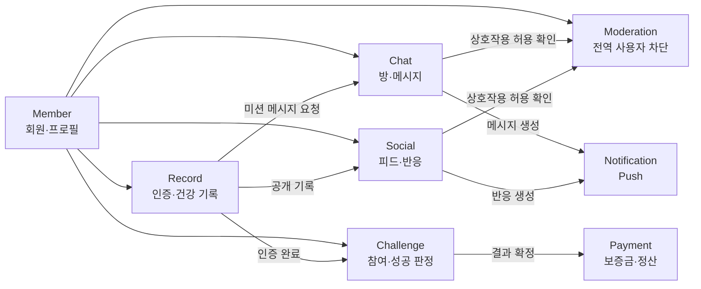

# Udaadaa Domain Boundaries

> 상태: 1차 리뷰 반영

## 1. 문서 목적

이 문서는 Udaadaa의 기능과 데이터를 Spring 모듈형 모놀리스에서 어떤 도메인이 책임질지 정의하기 위한 초안이다.

도메인 경계의 목표는 단순히 패키지를 나누는 것이 아니다. 비즈니스 규칙과 데이터의 최종 책임자를 명확히 하여 다음 문제를 방지하는 것이 핵심이다.

- 여러 모듈이 같은 데이터를 직접 수정
- 기능 변경 시 관련 코드의 위치를 찾기 어려움
- 모듈 사이의 순환 의존성
- 하나의 사용자 행동이 여러 곳에서 서로 다르게 처리됨
- 트랜잭션과 권한 검증의 책임이 불명확함

이 문서는 [System Inventory](01-system-inventory.md)와 [AS-IS Architecture](02-as-is-architecture.md)를 근거로 작성했다. D-01부터 D-06까지의 1차 리뷰 결과를 반영했으며, 세부 인터페이스와 트랜잭션 구현은 TO-BE 설계에서 확정한다.

## 2. 도메인 경계 설정 기준

각 기능은 다음 질문을 기준으로 같은 도메인에 포함하거나 분리한다.

1. 같은 비즈니스 용어와 규칙을 사용하는가?
2. 같은 이유로 함께 변경되는가?
3. 하나의 트랜잭션으로 처리해야 하는가?
4. 데이터 생성과 수정의 최종 책임자가 같은가?
5. 다른 기능 없이도 독립적인 비즈니스 의미가 있는가?

### 공통 원칙

- 하나의 데이터에는 하나의 소유 모듈만 둔다.
- 다른 모듈은 소유 모듈의 공개 기능을 통해 데이터를 변경한다.
- 다른 모듈의 Repository와 내부 Entity를 직접 참조하지 않는다.
- 모듈 사이에 순환 의존성을 만들지 않는다.
- 후속 처리는 같은 프로세스의 내부 이벤트로 연결할 수 있다.
- 초기 모듈형 모놀리스에서는 Kafka 같은 외부 메시지 브로커를 필수로 사용하지 않는다.
- Supabase, PostgreSQL, Storage와 FCM 같은 기술은 도메인이 아니라 도메인이 사용하는 인프라다.

## 3. 도메인 후보 요약

| 도메인 | 핵심 책임 | 분류 | 상태 |
|---|---|---|---|
| Member | 회원·프로필과 인증 사용자 연결 | 지원 도메인 | 1차 확정 |
| Chat | 채팅방·참가자·메시지·읽음·채팅 상호작용 | 주요 서비스 도메인 | 1차 확정 |
| Challenge | 챌린지 참여·미션 조건·성공 판정 | 핵심 도메인 | 1차 확정 |
| Record | 식단·운동·체중 인증과 건강 리포트 | 핵심 도메인 | 1차 확정 |
| Social | 인증 기록의 피드 노출·반응·피드 차단 | 주요 서비스 도메인 | 1차 확정 |
| Moderation | 사용자 간 전역 차단과 상호작용 허용 여부 | 지원 도메인 | 1차 확정 |
| Notification | Push 설정·기기 정보·발송과 재시도 | 지원 도메인 | 1차 확정 |
| Payment | 보증금·결제·환급·몰수·정산 | 미래 핵심 도메인 | 후속 |
| Admin | 회원·챌린지·정산 운영 기능 | 미래 지원 도메인 | 후속 |

## 4. 전체 도메인 관계 1차 확정안



화살표는 데이터베이스 직접 접근이 아니라 공개 서비스 호출 또는 내부 이벤트 관계를 의미한다. 실제 의존 방향은 TO-BE 설계에서 인터페이스와 이벤트를 기준으로 확정한다.

## 5. Member 도메인

### 담당 책임

- 서비스 회원 식별
- 닉네임·키·체중 등 프로필 관리
- 외부 인증 사용자와 서비스 회원 연결
- 회원 활성·탈퇴 상태 관리

### 소유 데이터 후보

- 현재 `profiles`
- 향후 `members`, `member_profiles`로 분리 가능
- Supabase Auth 사용자 ID와 서비스 회원 ID의 연결 정보
- 현재 `profiles`에 함께 있는 FCM token과 알림 설정은 Notification 이전 전까지만 임시 유지

### 담당하지 않는 책임

- 비밀번호와 OAuth token 직접 관리
- 채팅방별 알림 설정
- 전역 알림 설정과 기기 Push token의 목표 소유
- FCM Push 발송
- 채팅·피드·챌린지 데이터 직접 삭제

### 공개 기능 예시

- 회원 프로필 조회·수정
- 인증 사용자로 회원 식별
- 회원 탈퇴 요청
- 회원 존재 여부 확인

### 주요 이벤트 후보

- `MemberRegistered`
- `MemberProfileUpdated`
- `MemberWithdrawn`

### 경계 판단

Supabase Auth는 인증 수단이고 Member는 Udaadaa의 회원 정보를 담당한다. 초기 마이그레이션에서는 Supabase JWT를 검증하되, 비즈니스 로직은 Auth 사용자 대신 Member를 기준으로 처리한다.

## 6. Chat 도메인

### 담당 책임

- 채팅방 조회와 참가
- 방 참가 권한 검증
- 텍스트·이미지·미션 메시지 저장과 조회
- 메시지 삭제 상태 관리
- 읽음과 미읽음 기준 관리
- 메시지 반응 관리
- 특정 채팅 메시지 숨김
- Moderation을 통한 사용자 간 상호작용 허용 여부 확인
- 연결 복구 시 누락 메시지 조회 기준 제공

### 소유 데이터 후보

- `rooms`
- `room_participants`
- `messages`
- `read_receipts`
- `chat_reactions`
- `blocked_messages`
- 현재 `room_participants.push_option`은 Notification 이전 전까지만 임시 유지

### 담당하지 않는 책임

- 챌린지 성공 조건 계산
- 건강 인증 기록 생성
- 이미지 파일 자체 저장 구현
- FCM 발송 구현
- 전역 사용자 차단 정책
- 알림 설정의 목표 데이터
- 회원 프로필 수정

### 공개 기능 예시

- 방 참가·나가기
- 메시지 전송·삭제·조회
- 마지막 확인 메시지 갱신
- 메시지 반응·숨김
- 특정 회원의 방 참가 여부 확인
- 특정 기준 이후의 메시지 복구

### 주요 이벤트 후보

- `RoomJoined`
- `ChatMessageCreated`
- `ChatMessageDeleted`
- `ChatReactionAdded`

### 경계 판단

현재 `ChatCubit`, RLS와 Realtime에 분산된 권한 규칙을 Chat 도메인으로 모은다. Realtime과 WebSocket은 메시지를 전달하는 기술이며 메시지 저장과 방 참가 규칙은 Chat 도메인이 담당한다. 사용자 간 전역 차단은 Moderation에 확인하고, Chat은 허용된 사용자만 메시지 노출과 알림 대상에 포함한다.

## 7. Challenge 도메인

### 담당 책임

- 챌린지 참여와 기간 관리
- 일별 미션 조건 정의
- 인증 기록을 기준으로 미션 완료 여부 계산
- 연속 성공 일수 계산
- 챌린지 성공·실패·종료 상태 결정
- 향후 보증금 결과를 Payment에 전달

### 소유 데이터 후보

- 현재 `challenge`
- 향후 `challenges`, `challenge_participations`, `mission_progress`

### 담당하지 않는 책임

- 식단·운동·체중 원본 기록 저장
- 채팅 메시지 저장
- 피드 반응 관리
- 결제·환급·몰수 직접 처리

### 공개 기능 예시

- 챌린지 참여
- 현재 진행 상태 조회
- 인증 완료 반영
- 성공·실패 판정
- 챌린지 결과 조회

### 주요 이벤트 후보

- `ChallengeJoined`
- `MissionProgressUpdated`
- `ChallengeSucceeded`
- `ChallengeFailed`

### 경계 판단

현재 미션 완료 규칙은 `ChallengeCubit`에서 feed와 weight를 다시 조회하여 계산한다. 목표 경계에서는 Challenge가 규칙을 소유하고 Record의 인증 완료 결과만 전달받는다.

모든 채팅방이 챌린지와 연결되지는 않는다. 일반 채팅방은 Chat만 처리하고, 챌린지 방은 Challenge가 채팅방 ID와의 선택적 연결과 챌린지 기간을 관리한다. 챌린지 방 입장에서는 Chat 참가와 Challenge 참여를 하나의 애플리케이션 트랜잭션으로 처리하여 한쪽만 성공하는 상태를 허용하지 않는다.

## 8. Record 도메인

### 담당 책임

- 식단·운동·체중 인증 기록 생성
- 인증 이미지 참조 관리
- 식단 칼로리와 운동 시간 기록
- 일별 건강 리포트 계산
- 기록 수정·삭제에 따른 리포트 일관성 관리
- 인증 기록의 공개 가능 여부 결정

### 소유 데이터 후보

- 현재 `feed`
- `weight`
- `report`
- 향후 `records`, `daily_reports`로 명확하게 재구성 가능

### 담당하지 않는 책임

- 피드 반응과 피드 차단
- 챌린지 성공 조건 계산
- 채팅 메시지 직접 수정
- Storage SDK의 구체적인 업로드 구현

### 공개 기능 예시

- 식단·운동·체중 기록 생성
- 일별·기간별 리포트 조회
- 기록 삭제
- 공개 가능한 기록 조회

### 주요 이벤트 후보

- `HealthRecordCreated`
- `HealthRecordDeleted`
- `HealthRecordPublished`
- `DailyReportUpdated`

### 경계 판단

현재 `feed`는 건강 인증 원본과 소셜 피드 역할을 동시에 가진다. 초기 마이그레이션에서는 기록의 원본과 리포트 정합성을 Record가 소유하고 Social은 공개된 기록을 피드로 제공한다. 서비스가 확장되면 Record의 `health_records`와 Social의 `feed_posts`를 분리하고 `feed_posts`가 원본 기록을 참조하는 구조로 전환한다.

## 9. Social 도메인

### 담당 책임

- 공개된 인증 기록의 피드 노출
- 피드 정렬·탐색
- 피드 반응 관리
- 피드 차단 관리
- 반응 발생 알림 요청

### 소유 데이터 후보

- `reactions`
- `blocked_feed`
- `random_feed`는 Social 조회 모델 후보
- 향후 필요한 경우 공개 피드용 projection

### 참조 데이터

- Record가 소유한 공개 인증 기록
- Member의 공개 프로필

### 담당하지 않는 책임

- 건강 인증 원본 수정
- 일별 리포트 계산
- 챌린지 미션 판정
- FCM 직접 발송

### 공개 기능 예시

- 공개 피드 조회
- 피드 반응 추가·변경
- 피드 숨김
- 회원별 공개 기록 조회

### 주요 이벤트 후보

- `FeedReactionAdded`
- `FeedHidden`

### 경계 판단

Social은 공개된 기록을 읽지만 Record의 내부 데이터와 Repository를 직접 수정하지 않는다. 초기 이전에서는 기존 `feed` 테이블을 함께 사용하더라도 쓰기 책임은 Record 하나로 제한한다. 서비스 확장 후 별도 `feed_posts`를 도입하면 Social이 게시물 데이터를 소유한다.

## 10. Moderation 도메인

### 담당 책임

- 사용자 간 전역 차단 관계 생성·해제
- 두 회원 사이의 상호작용 허용 여부 판단
- Chat·Social·Notification에 일관된 차단 결과 제공
- 향후 신고·제재와 콘텐츠 제한으로 확장 가능한 정책 기반 제공

### 소유 데이터

- `blocked_users`
- 향후 `reports`, `sanctions` 등 운영 정책 데이터 검토 가능

### 담당하지 않는 책임

- 특정 채팅 메시지 숨김
- 특정 피드 숨김
- 채팅방 참가자 결정
- Push 설정과 발송

### 공개 기능 예시

- 사용자 차단·해제
- 두 회원의 상호작용 가능 여부 확인
- 후보 회원 목록에서 차단 관계 제외

### 주요 이벤트 후보

- `MemberBlocked`
- `MemberUnblocked`

### 경계 판단

`blocked_users`는 현재 채팅과 채팅 Push에 사용되지만 향후 피드·프로필 등 서비스 전체에 적용될 수 있으므로 Moderation이 소유한다. `blocked_messages`는 Chat, `blocked_feed`는 Social이 소유하며 전역 사용자 차단과 개별 콘텐츠 숨김을 구분한다.

## 11. Notification 도메인

### 담당 책임

- Push 발송 요청 수신
- 수신 대상과 알림 동의 확인
- 기기 Push token 관리
- 알림 메시지 생성과 FCM 호출
- 발송 성공·실패와 재시도 정책
- 중복 알림 방지 기준

### 목표 소유 데이터

- `notification_endpoints`: 회원별 기기와 FCM token
- `notification_preferences`: 전역·종류별 알림 설정
- 채팅방 등 대상별 알림 설정
- `notification_deliveries`: 발송 결과와 재시도 상태

### 점진적 이전

- 1단계: `profiles.fcm_token`, `profiles.push_option`, `room_participants.push_option` 유지
- 2단계: Notification 모듈의 등록·설정·발송 기능 구현
- 3단계: Notification 전용 테이블로 데이터 이전 후 기존 컬럼 제거

### 담당하지 않는 책임

- 메시지와 피드 반응 원본 생성
- 채팅방 참가 권한 결정
- 회원 프로필 수정
- FCM token 외 인증 token 관리

### 공개 기능 예시

- 기기 등록·해제
- 알림 설정 변경
- 채팅·반응 알림 발송 요청
- 발송 결과 조회

### 주요 이벤트 수신 후보

- `ChatMessageCreated`
- `FeedReactionAdded`
- 향후 `ChallengeSucceeded`

### 경계 판단

현재 Push는 DB Trigger, Edge Function과 FCM에 분산되어 있다. 목표 구조에서는 Notification이 FCM token, 알림 설정, 발송과 재시도를 소유한다. Chat과 Social은 Moderation을 적용한 업무 대상자를 결정하고 내부 이벤트로 알리며, Notification은 알림 설정을 적용하여 실제 Push를 발송한다.

## 12. 미래 도메인

### Payment

- 보증금 생성과 결제 승인
- 중복 결제 방지
- 챌린지 결과에 따른 환급·몰수
- 정산과 감사 로그
- 외부 결제 시스템 연동

Payment는 Challenge 결과를 입력으로 받지만 Challenge 테이블을 직접 수정하지 않는다. 금전 트랜잭션과 멱등성 기준이 필요하므로 별도 도메인으로 유지한다.

### Admin

- 회원·채팅방·챌린지 운영 조회
- 신고·제재와 운영 조치
- 결제·환급·정산 지원
- 운영 감사 기록

Admin은 다른 도메인의 내부 테이블을 직접 수정하는 우회 통로가 아니라 각 도메인의 관리자용 기능을 조합하는 영역으로 설계한다.

## 13. 도메인이 아닌 지원 기술

| 기술 | 사용하는 도메인 | 역할 |
|---|---|---|
| Supabase Auth | Member | 초기 인증과 JWT 발급 |
| PostgreSQL | 전체 | 도메인 데이터 저장 |
| WebSocket·Realtime | Chat | 실시간 이벤트 전달 |
| Storage | Chat, Record | 이미지 파일 저장 |
| FCM | Notification | Push 전달 |
| 외부 칼로리 API | Record | 식단 칼로리 계산 보조 |
| Analytics | 전체 | 행동과 오류 관찰 |

Storage와 외부 API는 도메인이 직접 SDK에 의존하기보다 도메인 밖의 인터페이스를 통해 사용한다. 구체적인 어댑터와 패키지 구조는 TO-BE 문서에서 정의한다.

## 14. 기존 데이터 소유권 1차 확정안

| 현재 데이터 | 추천 소유 도메인 | 비고 |
|---|---|---|
| `profiles` | Member | FCM token과 알림 설정은 Notification 이전 전까지만 임시 유지 |
| `rooms` | Chat | 챌린지 기간은 Challenge로 분리, 챌린지 연결은 선택적 |
| `room_participants` | Chat | 방별 알림 설정은 Notification 이전 전까지만 임시 유지 |
| `messages` | Chat | 미션 메시지도 Chat이 최종 저장 |
| `read_receipts` | Chat | 읽음 기준 개선 가능 |
| `chat_reactions` | Chat | 피드 반응과 구분 |
| `blocked_users` | Moderation | 사용자 간 전역 차단 |
| `blocked_messages` | Chat | 채팅 전용 |
| `challenge` | Challenge | 챌린지 기간과 선택적 방 연결 관리 |
| `feed` | Record | 초기 원본 소유, 확장 시 Social의 `feed_posts`와 분리 |
| `weight` | Record | 건강 기록 원본 |
| `report` | Record | Record 내부에서 일관성 관리 |
| `reactions` | Social | 피드 반응 |
| `blocked_feed` | Social | 피드 숨김 |
| `random_feed` | Social | 조회 모델 또는 projection 후보 |

## 15. 주요 사용자 흐름으로 경계 검토

### 로그인과 프로필

```text
Supabase Auth에서 사용자 인증
→ Member가 인증 사용자와 서비스 회원 연결
→ Member가 프로필 제공
```

Member만 관여하므로 경계가 단순하다.

### 채팅방 참가

```text
방의 챌린지 연결 여부 확인
→ 일반 방이면 Chat 참가만 처리
→ 챌린지 방이면 Chat 참가와 Challenge 참여를 함께 처리
→ 하나라도 실패하면 전체 취소
```

챌린지 방 입장은 같은 Spring 애플리케이션과 DB 안에서 조정 서비스와 트랜잭션으로 처리한다. 이를 통해 방에는 들어갔지만 챌린지에는 참여하지 않은 상태를 방지한다.

### 메시지 전송

```text
Chat이 권한 검증과 메시지 저장
→ Moderation을 통해 전역 차단 관계 적용
→ ChatMessageCreated 발생
→ WebSocket으로 참여자에게 전달
→ Notification이 알림 설정을 적용하고 Push 발송
```

메시지 저장은 Chat의 단일 트랜잭션이며 Push 실패가 메시지 저장을 취소하지 않는다.

### 미션 인증

```text
Record가 인증 기록과 리포트를 일관되게 저장
→ HealthRecordCreated 발생
→ Challenge가 미션 진행 상태 갱신
→ Chat이 미션 메시지 저장
→ 공개 기록이면 Social 피드에서 조회 가능
```

현재 하나의 RPC에 feed·weight와 Chat 메시지가 함께 있으므로 분리 시 실패와 재처리 기준을 정의해야 한다.

### 피드 반응

```text
Social이 피드 공개 여부 확인
→ Moderation을 통해 전역 차단 관계 적용
→ 반응 저장
→ FeedReactionAdded 발생
→ Notification이 피드 작성자에게 Push 발송
```

Social은 Record의 원본 기록을 수정하지 않는다.

### 회원 탈퇴

```text
Member가 탈퇴 절차 시작
→ 각 도메인이 회원 데이터 정리
→ 외부 Auth 사용자 삭제
→ 탈퇴 완료
```

단일 DB를 사용하는 모듈형 모놀리스에서는 중요한 삭제를 하나의 애플리케이션 흐름으로 조정할 수 있다. Auth 삭제는 외부 작업이므로 실패 복구와 재시도 기준이 별도로 필요하다.

## 16. 모듈 간 의존 규칙 1차 확정안

- Member ID는 모듈 간 공통 식별자로 전달할 수 있지만 Member Entity를 공유하지 않는다.
- Chat은 Challenge·Record·Notification Repository를 직접 호출하지 않는다.
- Chat과 Social은 사용자 간 상호작용 전에 Moderation의 공개 기능을 사용한다.
- Challenge는 Record의 테이블을 조회하여 미션을 재계산하지 않는다.
- Social은 Record의 공개 조회 기능 또는 조회 모델만 사용한다.
- Notification은 내부 이벤트를 통해 발송 요청을 받고 원본 업무 데이터를 수정하지 않는다.
- Notification은 FCM token, 알림 설정과 발송 결과를 최종 소유한다.
- Payment는 Challenge 결과 이벤트를 입력으로 받고 결제 결과를 독립적으로 관리한다.
- 즉시 결과가 필요하거나 함께 성공해야 하는 작업은 공개 Application Service와 조정 서비스를 동기 호출한다.
- 핵심 작업 이후의 독립적인 후속 처리는 동일 Spring 프로세스의 내부 이벤트로 연결한다.
- 초기에는 Kafka, RabbitMQ 같은 외부 메시지 브로커를 사용하지 않는다.
- 반드시 함께 성공해야 하는 작업과 실패 후 재시도할 작업을 구분한다.

## 17. 1차 리뷰에서 확정된 결정

### D-01. Record 도메인 이름

- 결정: `Record`
- 이유: 인증 제출뿐 아니라 체중, 일별 리포트와 기록 조회까지 포함하기 쉽다.

### D-02. `feed` 소유권

- 결정: 초기에는 Record가 기존 `feed` 원본을 소유하고 Social이 공개 조회한다.
- 확장: Record의 `health_records`와 Social의 `feed_posts`로 분리한다.
- 이유: 현재 feed 생성·삭제가 리포트 정합성에 직접 영향을 주기 때문이다.

### D-03. 채팅방과 챌린지의 관계

- 결정: 모든 채팅방이 챌린지와 연결되지는 않는다.
- 일반 방: Chat 참가만 처리한다.
- 챌린지 방: Challenge가 기간과 선택적 방 연결을 소유한다.
- 실패 처리: Chat 참가와 Challenge 참여 중 하나라도 실패하면 전체를 취소한다.

### D-04. 사용자 차단 범위

- 결정: `blocked_users`는 Moderation이 소유한다.
- Chat은 `blocked_messages`, Social은 `blocked_feed`를 소유한다.
- 이유: 사용자 간 차단을 향후 채팅·피드·프로필에 일관되게 적용할 수 있어야 한다.

### D-05. 알림 설정 소유권

- 결정: 목표 구조에서 Notification이 기기 token, 전역·종류별·대상별 알림 설정을 소유한다.
- 이전: 초기에는 기존 컬럼을 유지하고 Notification 마이그레이션 단계에서 전용 테이블로 옮긴다.
- 발송: Chat과 Social은 업무 대상자를 결정하고 Notification은 설정 적용과 FCM 발송을 담당한다.

### D-06. 모듈 연결 방식

- 결정: 즉시 결과·공동 트랜잭션은 Spring 내부 메서드로 처리한다.
- 결정: 핵심 작업 이후의 후속 처리는 Spring 내부 이벤트로 연결한다.
- 초기 제외: Kafka, RabbitMQ 같은 외부 메시지 브로커
- 이유: 같은 프로세스의 장점을 활용하면서도 모듈 책임을 분리하기 위해서다.

## 18. 1차 리뷰 결과와 다음 검증

1차 리뷰에서 다음 항목을 확정했다.

- 건강 인증과 리포트 도메인 이름은 Record다.
- 기존 `feed`는 초기에는 Record가 소유하고 확장 시 Social 게시물과 분리한다.
- 채팅방과 챌린지는 선택적으로 연결하며 챌린지 방 입장은 하나의 트랜잭션으로 처리한다.
- 전역 사용자 차단은 Moderation이 소유한다.
- 알림 기기·설정·발송의 목표 소유자는 Notification이다.
- 모듈 연결은 Spring 내부 메서드와 내부 이벤트를 목적에 맞게 사용한다.

TO-BE 설계에서는 내부 메서드의 공개 인터페이스, 이벤트 처리 시점, 트랜잭션 범위와 단계별 데이터 이전 방식을 검증한다.

경계가 확정되면 다음 TO-BE 문서에서 Spring 모듈 구조, API·WebSocket 흐름, 인증·권한, 트랜잭션과 모듈 이벤트 방식을 설계한다.
