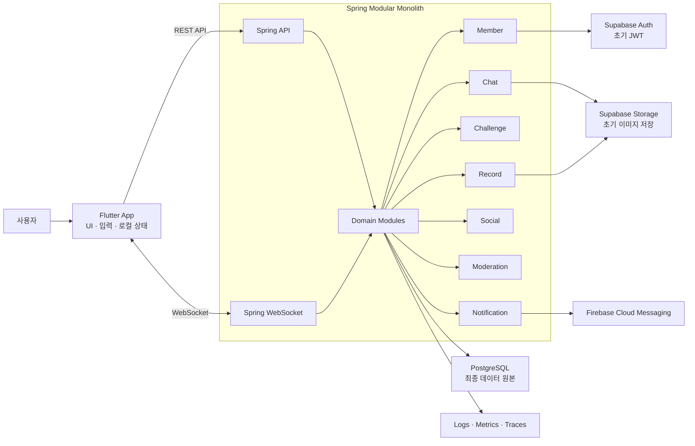
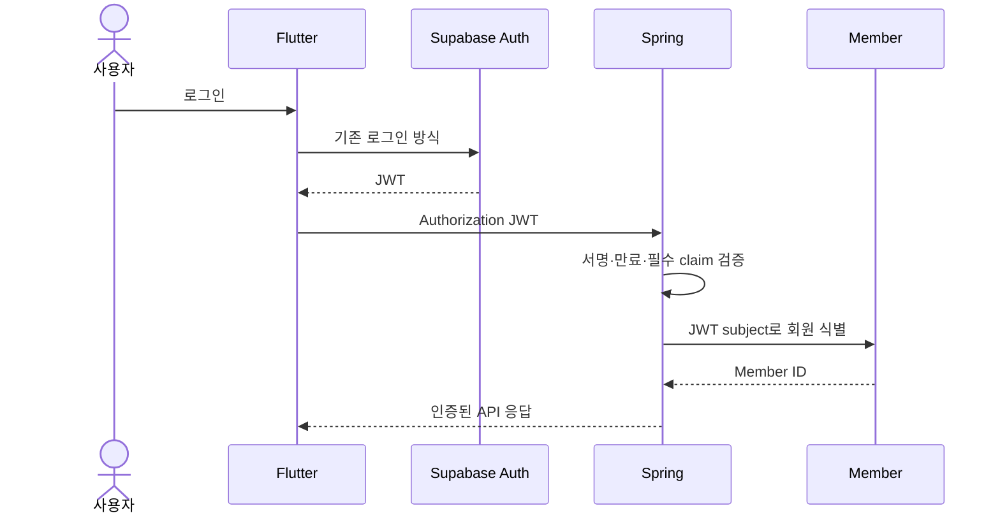
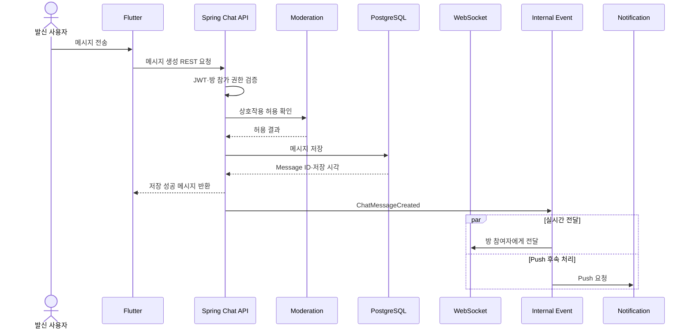
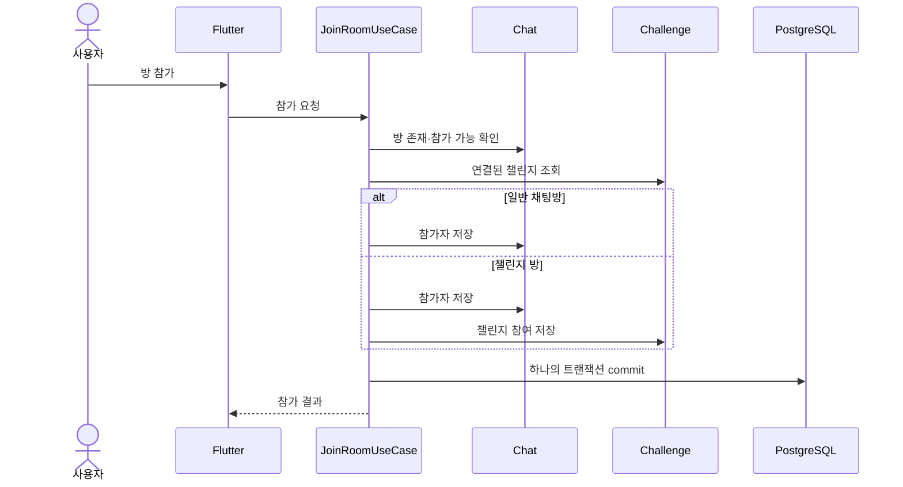
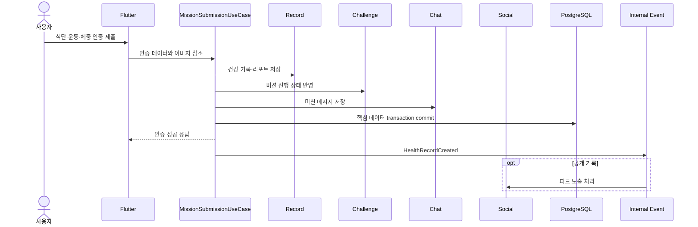
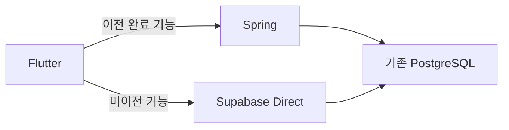

# Udaadaa TO-BE Architecture

> 상태: 검토 초안

## 1. 문서 목적

이 문서는 Udaadaa를 Flutter·Supabase 직접 연결 구조에서 Spring 기반 모듈형 모놀리스로 이전한 목표 구조를 정의한다.

[AS-IS Architecture](02-as-is-architecture.md)가 현재 기능의 처리 순서와 실패 경계를 설명한다면, 이 문서는 [Domain Boundaries](03-domain-boundaries.md)에서 정한 책임을 실제 서버 구조와 통신 방식으로 연결한다.

이 문서는 다음 내용을 결정하는 기준으로 사용한다.

- Flutter, Spring과 외부 플랫폼의 책임
- Spring 모듈과 모듈 간 연결 방식
- REST API, WebSocket과 내부 이벤트의 사용 기준
- 채팅 저장·전달·복구 방식
- 트랜잭션, 권한과 실패 처리 경계
- 목표 데이터 소유권과 점진적 Schema 변경 방향
- Supabase 직접 의존성을 기능별로 제거하는 방법

## 2. 설계 목표와 제외 범위

### 목표

- Flutter는 화면, 사용자 입력과 로컬 UI 상태에 집중한다.
- Spring은 인증된 사용자 식별, 권한, 비즈니스 규칙과 트랜잭션을 담당한다.
- PostgreSQL을 서비스 데이터의 최종 원본으로 사용한다.
- 메시지 저장 성공과 실시간 전달 성공을 분리한다.
- WebSocket 연결이 끊겨도 REST API로 누락 메시지를 복구한다.
- 각 데이터의 쓰기 주체를 하나의 도메인 모듈로 제한한다.
- 로그·지표·오류를 Spring 요청 단위로 추적한다.
- 기능 단위로 이전하여 서비스 중단과 데이터 유실을 방지한다.

### 이번 문서에서 확정하지 않는 내용

- 전체 REST endpoint와 Request·Response 명세
- 최종 SQL DDL과 migration 파일
- WebSocket의 STOMP 또는 자체 프로토콜 선택
- 배포 인프라와 서버 인스턴스 수
- 캐시·외부 메시지 브로커 도입 시점
- 결제사와 보증금 정산 규칙

## 3. 확정된 설계 조건

| 항목 | 결정 |
|---|---|
| 애플리케이션 구조 | Spring 기반 모듈형 모놀리스 |
| 클라이언트 역할 | Flutter는 UI·입력·로컬 화면 상태 담당 |
| 서버 역할 | 인증·권한·비즈니스 규칙·트랜잭션·관찰 담당 |
| 초기 인증 | 기존 Supabase Auth와 JWT 유지 |
| 초기 DB | 기존 Supabase PostgreSQL 유지 |
| 초기 이미지 저장 | 기존 Supabase Storage 유지 |
| 일반 클라이언트 통신 | REST API |
| 채팅 실시간 전달 | WebSocket |
| 채팅 누락 복구 | PostgreSQL 기준 REST API |
| 동기 모듈 연결 | Spring 내부 Application Service 호출 |
| 후속 처리 | Spring 내부 이벤트 |
| 초기 메시지 브로커 | Kafka·RabbitMQ 사용하지 않음 |
| 외부 Push | Firebase Cloud Messaging 유지 |
| 이전 방식 | 도메인·기능 단위 점진적 전환, 애플리케이션 이중 쓰기 금지 |

## 4. 목표 시스템 전체 구조



### 책임 변화

```text
AS-IS
Flutter Cubit → Supabase 직접 호출 → Flutter가 정합성 조정

TO-BE
Flutter → Spring → 도메인 규칙·트랜잭션 → DB·외부 서비스
```

Flutter는 더 이상 클라이언트가 전달한 사용자 ID를 기준으로 권한을 결정하지 않는다. Spring이 JWT에서 사용자를 식별하고 해당 사용자가 요청한 자원에 접근할 수 있는지 검증한다.

## 5. Spring 모듈 구조

### 모듈 목록

| 모듈 | 핵심 책임 | 목표 소유 데이터 |
|---|---|---|
| Member | 회원·프로필과 인증 사용자 연결 | 회원·프로필 |
| Chat | 방·참가자·메시지·읽음·채팅 반응·메시지 숨김 | 채팅 데이터 |
| Challenge | 챌린지 기간·참여·진행·성공 판정 | 챌린지와 미션 진행 |
| Record | 식단·운동·체중 인증과 일별 리포트 | 건강 기록과 리포트 |
| Social | 공개 피드·반응·피드 숨김 | 피드 게시·반응 데이터 |
| Moderation | 사용자 간 전역 차단과 상호작용 정책 | 사용자 차단 관계 |
| Notification | 기기·알림 설정·발송·재시도 | token, preference, delivery |
| Payment | 향후 보증금·환급·몰수·정산 | 결제와 정산 데이터 |

### 모듈 내부 기본 구조

```text
module
├─ presentation
│  └─ REST Controller · WebSocket Handler
├─ application
│  └─ Use Case · Transaction · 모듈 조정
├─ domain
│  └─ Entity · Value Object · Domain Service · Event
└─ infrastructure
   └─ JPA · Storage · Auth · FCM Adapter
```

### 모듈 접근 규칙

- 외부 요청은 presentation을 거쳐 application으로 진입한다.
- 비즈니스 규칙은 domain에 둔다.
- DB와 외부 SDK 의존성은 infrastructure에 둔다.
- 다른 모듈의 Entity와 Repository를 직접 참조하지 않는다.
- 즉시 결과가 필요하면 상대 모듈의 공개 Application Service를 호출한다.
- 후속 작업은 내부 이벤트로 전달한다.
- Member ID 같은 식별자는 전달할 수 있지만 Member Entity를 공유하지 않는다.

## 6. 통신 방식과 선택 이유

| 상황 | 통신 방식 | 선택 이유 |
|---|---|---|
| Flutter의 일반 조회·생성·수정 | REST API | 요청과 응답이 명확하고 테스트·오류·재시도 처리가 쉬움 |
| 채팅 새 메시지 전달 | WebSocket | 서버가 연결된 사용자에게 새 메시지를 즉시 전달해야 함 |
| 채팅 연결 복구·누락 조회 | REST API | WebSocket 연결 중 놓친 이벤트를 DB의 저장 결과로 복구해야 함 |
| 즉시 결과가 필요한 모듈 연결 | Spring 내부 메서드 | 같은 프로세스에서 바로 결과를 받고 불필요한 네트워크 호출을 만들지 않음 |
| 여러 모듈이 함께 성공해야 하는 작업 | 조정 서비스와 DB 트랜잭션 | 챌린지 방 참가처럼 일부 성공을 허용하지 않는 작업을 함께 커밋하거나 취소해야 함 |
| Push 등 핵심 작업 이후 처리 | Spring 내부 이벤트 | Push 실패가 메시지·반응 같은 핵심 데이터 저장을 취소하지 않도록 분리 |
| 서비스 데이터 저장 | PostgreSQL | 관계형 데이터의 트랜잭션과 정합성을 보장하고 기존 데이터를 이어서 사용 가능 |
| 이미지 파일 저장 | 초기 Supabase Storage | 기존 파일과 URL을 유지하여 초기 데이터 이전 위험과 범위를 줄임 |
| Push 알림 전달 | Firebase Cloud Messaging | 기존 Android·iOS Push 구조와 Flutter 연동을 유지할 수 있음 |
| 사용자 인증 | 초기 Supabase Auth·JWT | 기존 계정과 로그인 세션을 유지하면서 비즈니스 로직부터 이전 가능 |
| 외부 칼로리 계산 | Spring HTTP Client | 인증·timeout·재시도·오류와 사용량 정책을 서버에서 통합 관리 가능 |
| 운영 로그·지표 수집 | Spring 관찰 기능 | API부터 DB·WebSocket·외부 API까지 하나의 요청 흐름으로 추적 가능 |

### 통신 방식 선택 기준

```text
요청과 응답이 명확함
→ REST API

서버의 즉시 전달이 필요함
→ WebSocket

같이 성공하거나 취소해야 함
→ 내부 메서드 + DB 트랜잭션

핵심 작업 이후 독립적으로 처리 가능함
→ 내부 이벤트
```

WebSocket만으로 채팅을 구현하면 연결이 끊긴 동안의 누락을 복구하기 어렵고, REST만 사용하면 새 메시지를 즉시 전달하기 어렵다. 따라서 WebSocket은 전달, REST와 PostgreSQL은 저장·조회·복구를 담당한다.

## 7. 모듈 연결 방식

### 동기 내부 메서드

사용자에게 즉시 결과를 반환하거나 여러 모듈의 데이터가 함께 성공해야 할 때 사용한다.

```text
ChallengeRoomJoinUseCase
├─ Chat.joinRoom(memberId, roomId)
└─ Challenge.joinByRoom(memberId, roomId)
```

두 작업은 같은 Spring 애플리케이션과 PostgreSQL 트랜잭션 안에서 수행한다. Challenge 참여가 실패하면 Chat 참가도 롤백한다.

### 내부 이벤트

핵심 데이터를 저장한 후 독립적인 후속 작업을 실행할 때 사용한다.

```text
ChatMessageCreated
→ WebSocket 전달
→ Notification Push 발송
```

```text
FeedReactionAdded
→ Notification Push 발송
```

내부 이벤트는 초기에는 같은 Spring 프로세스 안에서 처리한다. 이벤트 유실이 금전·정산 또는 필수 알림에 영향을 주는 시점에는 Outbox와 외부 메시지 브로커 도입 여부를 다시 검토한다.

## 8. 인증과 권한 구조



### 권한 원칙

- 요청 본문의 `userId`를 권한 판단에 사용하지 않는다.
- JWT의 검증된 subject를 Member ID와 연결한다.
- 사용자 수정 가능 metadata를 권한 근거로 사용하지 않는다.
- Chat은 방 참가 여부를 서버에서 검증한다.
- Record·Social은 작성자와 공개 범위를 검증한다.
- Moderation은 사용자 간 전역 차단 정책을 제공한다.
- service role과 DB 관리 권한은 Flutter에 노출하지 않는다.
- Spring은 필요한 범위만 가진 DB 계정을 사용한다.
- Flutter의 Supabase Data API 직접 접근이 남은 기간에는 RLS를 유지한다.

## 9. 채팅 저장·전달·복구 흐름

### 메시지 전송



### 발신자 화면 반영 기준

- 발신자는 DB 저장 성공 응답으로 메시지를 화면에 반영한다.
- 같은 메시지의 WebSocket 이벤트를 받으면 Message ID를 기준으로 중복을 제거한다.
- WebSocket 전달 실패는 DB 저장 성공을 취소하지 않는다.
- 클라이언트가 재시도할 때 중복 메시지가 생기지 않도록 `clientMessageId` 또는 멱등성 키를 검토한다.

### 연결 복구

```text
WebSocket 연결 끊김
→ Flutter가 연결 상태 표시
→ 재연결 시 마지막 확인 Message ID 또는 cursor 전송
→ REST API로 이후 메시지 조회
→ DB 결과를 로컬 메시지와 병합·중복 제거
→ WebSocket 재구독
```

### 읽음 기준

- 메시지마다 모든 읽음 행을 생성하는 현재 방식과 방별 마지막 읽음 위치 방식의 장단점을 비교한다.
- 목표 기준은 `마지막으로 확인한 Message ID 또는 순서 값`을 서버에 저장하고 이후 메시지를 미읽음으로 계산하는 방향을 우선 검토한다.
- 정확한 Schema는 데이터 모델 리뷰에서 확정한다.

## 10. 일반 방과 챌린지 방 참가



- 모든 채팅방이 챌린지와 연결되지는 않는다.
- Challenge가 챌린지 기간과 선택적 방 연결을 소유한다.
- 챌린지 방에서는 Chat 참가와 Challenge 참여가 함께 성공하거나 함께 롤백한다.

## 11. 미션 인증 흐름



### 트랜잭션 원칙

- 건강 기록과 해당 일자의 리포트 갱신은 Record 안에서 함께 처리한다.
- 챌린지 미션 진행과 채팅 미션 메시지가 인증 성공 조건에 필수라면 조정 서비스가 같은 트랜잭션으로 호출한다.
- 피드 노출, WebSocket 전달과 Push는 핵심 데이터 commit 이후 처리한다.
- 이미지 업로드와 DB 저장은 하나의 DB 트랜잭션으로 묶을 수 없으므로 실패 시 파일 정리 또는 임시 업로드 만료 정책이 필요하다.

## 12. 피드·차단·알림 흐름

### 피드 반응

```text
Flutter → Social REST API
→ Record의 공개 기록 여부 확인
→ Moderation의 상호작용 허용 확인
→ Social이 반응 저장
→ FeedReactionAdded 내부 이벤트
→ Notification이 설정 적용 후 FCM 발송
```

### 차단 소유권

| 기능 | 소유 모듈 |
|---|---|
| 사용자 간 전역 차단 | Moderation |
| 특정 채팅 메시지 숨김 | Chat |
| 특정 피드 숨김 | Social |

### 알림 소유권

- Notification이 FCM token, 전역·종류별·대상별 설정을 최종 소유한다.
- Chat과 Social은 업무 규칙과 Moderation을 적용하여 알림 대상 후보를 결정한다.
- Notification은 개인 설정, token 상태, 중복과 재시도를 적용하여 실제 발송한다.
- 기존 `profiles`와 `room_participants`의 알림 컬럼은 Notification 이전 단계까지 유지한다.

## 13. 목표 논리 데이터 모델

다음 이름은 목표 책임을 표현하는 논리 모델이며 최종 SQL 이름은 아니다.

| 모듈 | 목표 데이터 | 기존 데이터와의 관계 |
|---|---|---|
| Member | `members`, `member_profiles` | `profiles`에서 회원·프로필 분리 검토 |
| Chat | `chat_rooms`, `room_participants`, `chat_messages`, `read_positions`, `chat_reactions`, `hidden_messages` | 기존 채팅 테이블을 단계적으로 정리 |
| Challenge | `challenges`, `challenge_room_links`, `challenge_participations`, `mission_progress` | `rooms` 기간과 `challenge` 역할 분리 |
| Record | `health_records`, `daily_reports` | 초기에는 `feed`, `weight`, `report` 유지 후 분리 |
| Social | `feed_posts`, `feed_reactions`, `hidden_feed_posts` | 초기에는 Record의 `feed` 공개 조회 |
| Moderation | `user_blocks` | `blocked_users`에서 이전 또는 이름 유지 가능 |
| Notification | `notification_endpoints`, `notification_preferences`, `notification_deliveries` | `profiles`, `room_participants`의 알림 데이터 이전 |

### Schema 변경 원칙

```text
기존 구조 유지
→ 새 테이블·컬럼 추가
→ 데이터 백필
→ 단일 쓰기 주체 전환
→ 읽기 검증
→ 기존 컬럼·테이블 제거
```

- 새 구조와 기존 구조를 애플리케이션에서 장기간 이중 쓰기하지 않는다.
- 기능별 전환 시점에 쓰기 주체를 Flutter 또는 Spring 중 하나로 고정한다.
- 제거는 새 구조의 읽기·쓰기와 복구 검증이 끝난 후 별도 migration으로 수행한다.

## 14. 트랜잭션과 실패 처리

| 작업 | 핵심 트랜잭션 | commit 이후 처리 | 실패 원칙 |
|---|---|---|---|
| 일반 방 참가 | Chat 참가 저장 | 필요 시 WebSocket 상태 갱신 | 실패 시 참가 없음 |
| 챌린지 방 참가 | Chat 참가 + Challenge 참여 | 환영 메시지·알림 | 하나라도 실패하면 전체 롤백 |
| 텍스트 메시지 | Chat 메시지 저장 | WebSocket·Push | 전달 실패가 저장을 취소하지 않음 |
| 미션 인증 | Record·리포트 + 필수 Challenge·Chat 처리 | Social 노출·WebSocket·Push | 핵심 데이터는 함께 성공, 파일은 보상 처리 |
| 피드 반응 | Social 반응 저장 | Push | Push 실패가 반응을 취소하지 않음 |
| 회원 탈퇴 | 탈퇴 상태와 로컬 데이터 정리 조정 | 외부 Auth 삭제·재시도 | 외부 실패 상태를 기록하고 복구 가능해야 함 |

### 내부 이벤트 처리 원칙

- 이벤트는 DB commit 이후 실행할지 같은 트랜잭션 안에서 실행할지 목적별로 구분한다.
- Push·WebSocket처럼 독립적인 부수효과는 commit 이후 처리한다.
- 필수 도메인 상태 변경은 이벤트에만 의존하지 않고 동기 조정 서비스를 사용할 수 있다.
- 같은 이벤트가 다시 처리돼도 중복 결과가 생기지 않도록 멱등성을 고려한다.

## 15. Storage와 외부 API

### 이미지

- 초기에는 기존 Supabase Storage Bucket과 파일 경로를 유지한다.
- Flutter가 임의의 사용자·방 경로에 업로드하지 못하도록 Spring이 업로드 권한과 경로를 결정해야 한다.
- Spring을 통한 파일 proxy 업로드와 제한된 직접 업로드 방식은 비용·보안·구현 난이도를 비교한 뒤 결정한다.
- DB 저장 실패 시 임시 파일 정리 또는 만료 정책을 둔다.
- 장기적으로 Storage 구현이 바뀌어도 Chat과 Record 도메인 규칙은 변경되지 않도록 인터페이스로 분리한다.

### 외부 칼로리 API

- Flutter 직접 호출을 Spring Record 모듈의 외부 API Adapter로 이전한다.
- timeout, 재시도, 응답 검증, 사용량과 오류 로그를 서버에서 관리한다.
- 외부 API 실패가 사용자의 입력 전체를 잃게 하지 않도록 재시도 또는 수동 입력 경로를 검토한다.

## 16. 관찰과 운영 안정성

### 로그

- 요청마다 correlation ID를 생성한다.
- 회원 ID, 방 ID, Message ID 같은 추적용 식별자는 최소 범위로 기록한다.
- 메시지 본문, FCM token, JWT와 비밀 키는 로그에 기록하지 않는다.
- 외부 API·WebSocket·Push 실패 원인을 구분한다.

### 지표

- REST 요청 성공률과 지연 시간
- 메시지 DB 저장 시간
- DB 저장부터 WebSocket 전달까지의 시간
- WebSocket 연결·재연결 수
- 누락 복구 메시지 수
- Push 성공·실패·재시도 수
- 외부 칼로리 API 오류율과 지연 시간

### 장애 대응

- DB 저장 성공 여부를 사용자 응답의 기준으로 삼는다.
- WebSocket 장애 시 REST 복구 경로를 제공한다.
- Push 장애는 메시지·반응 저장과 분리한다.
- 외부 서비스 오류가 어떤 도메인 기능에 영향을 주는지 대시보드와 알림으로 구분한다.

## 17. 점진적 마이그레이션 구조



### 기능별 전환 절차

1. 기존 동작과 API 완료 기준을 정의한다.
2. Spring이 기존 DB를 읽어 AS-IS 결과와 비교한다.
3. Spring 쓰기와 테스트를 검증한다.
4. Flutter의 해당 기능 쓰기를 Spring API로 한 번에 전환한다.
5. 전환한 기능의 Supabase 직접 쓰기를 제거한다.
6. 안정화 후 Realtime·Edge Function·RLS·Storage 직접 의존성을 정리한다.
7. 필요한 목표 Schema 변경은 기능 전환과 별도 단계로 수행한다.

### 금지 사항

- 같은 기능을 Flutter와 Spring이 동시에 수정하는 애플리케이션 이중 쓰기
- 검증되지 않은 전체 Schema 일괄 교체
- 사용자 데이터 행을 확인 없이 삭제하거나 덮어쓰기
- 권한 검증을 클라이언트 입력에 의존
- 실시간 이벤트만을 메시지의 최종 원본으로 사용

## 18. AS-IS와 TO-BE 비교

| 항목 | AS-IS | TO-BE |
|---|---|---|
| 비즈니스 로직 | Flutter·Edge Function·DB Function에 분산 | Spring 도메인 모듈 중심 |
| 데이터 접근 | Flutter가 Supabase 직접 호출 | Flutter가 Spring API 호출 |
| 사용자 식별 | 클라이언트 사용자 ID 사용 구간 존재 | 검증한 JWT subject 기준 |
| 메시지 성공 기준 | Realtime 이벤트 수신 후 화면 반영 | DB 저장 응답으로 즉시 반영 |
| 실시간 통신 | Supabase Realtime | Spring WebSocket |
| 연결 복구 | Flutter의 분산 로직 | 마지막 cursor 이후 REST 조회 |
| 권한 | RLS·Function·Flutter에 분산 | Spring 중심, 전환 중 RLS 유지 |
| 트랜잭션 | Storage·RPC·Cubit 작업 분리 | 서버가 핵심 트랜잭션과 후속 작업 구분 |
| Push | DB Trigger·Edge Function | 내부 이벤트·Notification 모듈 |
| 사용자 차단 | Chat과 Push 코드에 결합 | Moderation 정책으로 통합 |
| 모니터링 | Flutter·Supabase·Edge에 분산 | Spring 요청·도메인·외부 호출 통합 |

## 19. 기술 결정 상태

### 1차 확정

- Spring 모듈형 모놀리스
- REST API와 WebSocket 병행
- PostgreSQL을 메시지와 업무 데이터의 최종 원본으로 사용
- REST 기반 채팅 누락 복구
- Spring 내부 메서드와 내부 이벤트 사용
- 초기 Supabase Auth·PostgreSQL·Storage 유지
- FCM 유지
- 초기 외부 메시지 브로커 제외
- 기능 단위 전환과 애플리케이션 이중 쓰기 금지

### 결정 필요

- WebSocket에서 STOMP를 사용할지 자체 메시지 프로토콜을 사용할지
- Flutter 이미지 업로드를 Spring proxy로 처리할지 제한된 직접 업로드로 처리할지
- Spring Modulith를 도입해 모듈 경계와 이벤트를 검증할지
- 내부 이벤트의 재시도·유실 방지를 위해 Outbox가 필요한 시점
- DB를 모듈별 PostgreSQL Schema로 분리할지 단일 Schema에서 규칙으로 제한할지
- 메시지 순서 기준과 읽음 cursor의 정확한 데이터 타입
- 회원 탈퇴의 보존·익명화·외부 Auth 삭제 순서

## 20. 다음 문서와 완료 조건

TO-BE 아키텍처는 다음 항목을 리뷰한 뒤 확정한다.

- 전체 시스템과 모듈 책임에 동의
- 통신 방식과 선택 이유에 동의
- 핵심 트랜잭션과 commit 이후 작업의 구분에 동의
- 채팅 저장·전달·복구 기준에 동의
- 목표 논리 데이터 모델과 점진적 이전 원칙에 동의
- 기술 결정 필요 항목의 처리 순서에 동의

확정 후 다음 문서에서 도메인별 마이그레이션 순서, 사전 조건, 전환 기준과 롤백 조건을 작성한다.
