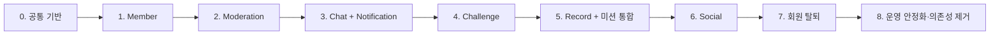

# Udaadaa Domain Migration Roadmap

> 상태: 1차 초안
> 작성일: 2026-07-27

## 1. 문서 목적

이 문서는 Udaadaa의 기능을 Flutter·Supabase 직접 연결 구조에서 Spring 기반 모듈형 모놀리스로 이전하는 순서와 단계별 완료 기준을 정의한다.

단순히 Spring 코드를 작성하는 순서가 아니라 각 기능의 쓰기 주체를 안전하게 전환하는 절차를 다룬다. 모든 단계는 기존 서비스 중단, 데이터 유실과 Flutter·Spring의 이중 쓰기를 방지해야 한다.

## 2. 로드맵 기본 원칙

### 기능 단위 전환

- 전체 도메인을 한 번에 교체하지 않고 사용자가 구분할 수 있는 기능 단위로 이전한다.
- 새로운 Spring 기능은 기존 Supabase PostgreSQL을 먼저 사용한다.
- Flutter의 기존 Supabase 직접 호출은 Spring API 검증이 끝날 때까지 유지한다.
- 전환 시점에는 해당 기능의 쓰기 주체를 Flutter 또는 Spring 중 하나로만 둔다.
- 읽기 결과 비교를 위한 Shadow Read는 허용하지만 같은 작업의 이중 쓰기는 금지한다.

### 단계별 공통 흐름

```text
기존 동작과 데이터 확인
→ Spring 읽기 구현·결과 비교
→ Spring 쓰기와 자동화 테스트 구현
→ 기존 데이터 백필 또는 호환성 확인
→ Flutter 호출을 Spring으로 전환
→ 운영 지표와 오류 확인
→ 기존 Supabase 직접 호출·Trigger·Edge Function 제거
```

### 데이터 변경 방식

```text
Expand: 새 테이블·컬럼을 기존 기능과 호환되게 추가
→ Backfill: 기존 데이터를 새 구조에 채우고 검증
→ Switch: 읽기와 쓰기의 주체를 Spring으로 전환
→ Contract: 안정화 후 기존 구조와 의존성 제거
```

- 삭제와 이름 변경보다 호환 가능한 추가를 먼저 수행한다.
- Schema 변경은 migration 파일로 관리하고 적용 전 백업·복구 절차를 확인한다.
- Supabase Data API 직접 접근이 남은 테이블은 RLS를 유지한다.
- Spring 전용 권한과 Flutter 공개 권한을 분리하고 `service_role` 또는 관리 권한을 Flutter에 노출하지 않는다.

## 3. 전체 이전 순서



| 단계 | 주요 범위 | 이 순서인 이유 |
|---|---|---|
| 0 | Spring 공통 기반 | 모든 도메인이 같은 인증·오류·DB·관찰 기준을 사용해야 함 |
| 1 | Member | JWT 사용자를 Udaadaa 회원으로 연결해야 다른 도메인의 권한을 판단할 수 있음 |
| 2 | Moderation | Chat과 Social이 공통 차단 정책을 사용하기 전에 규칙의 소유권을 확정해야 함 |
| 3 | Chat + Notification | 사용자 지연 피드백이 있는 핵심 기능이며 Push 쓰기 주체를 함께 바꿔야 중복 알림을 방지할 수 있음 |
| 4 | Challenge | 방 참가와 미션 진행 규칙을 서버에 마련해야 Record 인증 결과를 안전하게 연결할 수 있음 |
| 5 | Record + 미션 통합 | Record·Challenge·Chat에 걸친 현재 `mission_complete` 처리를 하나의 서버 흐름으로 전환해야 함 |
| 6 | Social | 공개 기록을 만드는 Record가 안정된 후 피드 노출과 반응을 분리하는 것이 안전함 |
| 7 | 회원 탈퇴 | 모든 도메인의 데이터 소유권과 삭제·익명화 규칙이 정리된 후 통합 처리해야 함 |
| 8 | 안정화·의존성 제거 | 새 경로의 운영 안정성을 확인한 뒤에만 Realtime·Edge Function 등의 기존 경로를 제거할 수 있음 |

Payment와 Admin은 현재 기능 마이그레이션이 안정된 후 별도 로드맵으로 다룬다.

## 4. 단계 0: Spring 공통 기반

상세 계획과 진행 기록: [Phase 0: Spring Foundation](phases/phase-00-foundation.md)

### 목표

모든 도메인이 공통으로 사용할 실행·인증·데이터 접근·관찰 기반을 만든다.

### 작업

- Spring Boot와 Java 버전 확정
- Spring Modulith 호환 버전 확인과 모듈 경계 검증 설정
- 기존 Supabase PostgreSQL 연결과 최소 권한 DB 계정 구성
- Supabase JWT 서명·만료·subject 검증
- JWT subject와 Member 연결을 위한 공통 인증 객체 정의
- REST 오류 응답, validation과 correlation ID 규칙 정의
- DB migration 도구와 환경별 설정 분리
- 테스트 환경과 CI의 기본 빌드·테스트 구성
- 비밀 키를 저장소 밖의 환경 변수 또는 Secret 저장소에서 주입
- API·DB·외부 호출의 기본 로그와 지표 구성

### 완료 기준

- 인증된 테스트 요청이 Spring에서 사용자 subject로 식별됨
- 잘못되거나 만료된 JWT가 일관된 오류로 거부됨
- Spring이 기존 DB를 읽되 Flutter용 관리 키를 사용하지 않음
- 모듈 의존성 검증 테스트와 기본 애플리케이션 테스트가 통과함
- 로그에 JWT, FCM token, 메시지 본문과 비밀 키가 기록되지 않음

### 롤백 기준

- 이 단계는 Flutter 호출을 변경하지 않으므로 배포를 중지하거나 Spring만 이전 버전으로 되돌린다.

## 5. 단계 1: Member

상세 계획과 진행 기록: [Phase 1: Member Migration](phases/phase-01-member.md), [2026-07-29 Phase 1 진행 기록](progress/2026-07-29-phase-01-progress.md)

### 이전 기능

- 인증 사용자와 `profiles` 연결
- 내 프로필 조회·수정
- 다른 기능에서 사용할 최소 회원 조회
- 회원 상태 `ACTIVE`, `WITHDRAWAL_PENDING`, `WITHDRAWN` 기반 마련

### 이전 순서

1. Spring이 JWT subject로 기존 `profiles`를 읽는다.
2. Flutter의 기존 조회 결과와 Spring 응답을 비교한다.
3. 프로필 수정 API와 권한 테스트를 구현한다.
4. Flutter 프로필 조회·수정을 Spring API로 전환한다.
5. 해당 기능의 Supabase 직접 update를 제거한다.

### 완료 기준

- 요청 본문의 사용자 ID가 아니라 검증된 JWT subject로 회원을 식별함
- 본인 프로필만 수정할 수 있음
- 기존 사용자 프로필의 누락이나 변경 없이 조회됨
- Flutter에서 프로필 직접 쓰기가 제거됨

### 롤백 기준

- Spring 쓰기 전환 전에는 Flutter의 기존 읽기 경로로 복귀할 수 있다.
- Spring 쓰기가 시작된 후에는 데이터 호환성을 확인하고 서버를 수정하거나 이전 호환 API로 전환한다. 검증 없이 두 쓰기 경로를 동시에 켜지 않는다.

## 6. 단계 2: Moderation

### 이전 기능

- 사용자 간 차단 생성·해제·조회
- Chat과 Social에서 사용할 상호작용 허용 여부 판단
- 기존 `blocked_users` 데이터 소유권을 Moderation으로 이동

특정 메시지 숨김은 Chat, 특정 피드 숨김은 Social에 계속 둔다.

### 완료 기준

- 차단 관계의 생성·해제 권한이 서버에서 검증됨
- 양방향 상호작용 허용 규칙이 자동화 테스트로 고정됨
- Chat과 Social이 `blocked_users` Repository를 직접 사용하지 않고 Moderation의 공개 기능을 사용함
- Flutter의 사용자 차단 직접 쓰기가 제거됨

### 롤백 기준

- 기존 테이블 형식과 호환되는 동안 Flutter 읽기 경로로 복귀할 수 있다.
- 차단 쓰기는 항상 한 경로만 활성화한다.

## 7. 단계 3: Chat + Notification

Chat은 위험을 줄이기 위해 하위 기능을 나누어 전환한다.

### 3-1. 채팅 조회와 복구

- 방 목록·참가자·메시지 조회 REST API
- 서버 BIGINT 메시지 순번과 `clientMessageId` 설계
- 방별 `lastReadSequence` 기반 읽음 위치
- 마지막 순번 이후 누락 메시지 조회 API
- 기존 메시지와 새 순번의 백필·호환 전략

완료 기준:

- 기존 Flutter 조회 결과와 Spring 조회 결과가 허용 범위에서 일치함
- 정렬 기준이 생성 시각이 아니라 서버 순번으로 고정됨
- 중복·누락 없이 페이지 조회와 연결 복구가 가능함

### 3-2. 텍스트 메시지 저장과 실시간 전달

```text
Flutter → Spring REST 메시지 저장
→ PostgreSQL commit
→ 발신자에게 저장 결과 반환
→ commit 이후 내부 이벤트
→ STOMP 전달
```

- 방 참가 권한과 Moderation 규칙 검증
- `clientMessageId` 기반 중복 전송 방지
- STOMP 연결·JWT·방 구독 권한 검증
- 재연결 후 REST 누락 복구
- DB 저장 시간과 STOMP 전달 시간 지표 수집

완료 기준:

- 발신자는 Realtime 수신을 기다리지 않고 DB 저장 응답으로 메시지를 확인함
- 같은 `clientMessageId` 재요청이 중복 메시지를 만들지 않음
- 비참가자가 방을 구독하거나 메시지를 보낼 수 없음
- STOMP 연결이 끊겨도 REST로 누락 메시지를 복구함
- Flutter의 텍스트 메시지 직접 insert가 제거됨

### 3-3. 채팅 부가 기능과 이미지

- 방 참가·나가기
- 읽음 위치 갱신
- 메시지 반응·삭제·숨김
- Spring 승인 후 Supabase Storage 제한 직접 업로드
- 미완료 업로드 파일의 정리 또는 만료 처리

### 3-4. Notification 전환

- 기기 token과 전역·종류별·방별 알림 설정
- `ChatMessageCreated` 내부 이벤트 이후 FCM 발송
- 대상자·차단·설정·중복 검증
- 발송 성공·실패 지표와 재시도 가능 상태 기록
- 기존 DB Trigger와 Edge Function의 메시지 Push 경로 제거

전환 시 주의사항:

- Spring Push와 기존 DB Trigger Push를 동시에 활성화하지 않는다.
- 메시지 쓰기 주체가 Spring으로 전환되는 배포 단위에서 Push 주체도 Spring으로 전환한다.
- WebSocket 또는 Push 실패는 저장된 메시지를 취소하지 않는다.

### 단계 완료 기준

- 텍스트·이미지·읽음·반응의 주요 시나리오 테스트가 통과함
- 메시지 저장 성공률과 저장·전달 지연을 관찰할 수 있음
- 중복 Push가 발생하지 않음
- 일정 관찰 기간 동안 치명적인 누락과 권한 오류가 없음
- 전환된 Chat 기능의 Supabase Realtime 구독과 직접 DB 쓰기가 Flutter에서 제거됨

### 롤백 기준

- STOMP 장애 시 저장 API는 유지하고 Flutter가 REST polling·재조회로 메시지를 복구할 수 있어야 한다.
- DB 저장 오류나 권한 오류가 기준치를 넘으면 신규 Spring 쓰기 배포를 중단한다.
- 이전 쓰기 경로 복귀가 필요하면 새 Schema와 기존 Flutter의 호환성을 먼저 검증한다. 두 쓰기 경로를 동시에 활성화하지 않는다.

## 8. 단계 4: Challenge

### 이전 기능

- 일반 채팅방과 챌린지 방 구분
- 챌린지 생성 정보·기간·참여 상태 조회
- 챌린지 방 입장 시 Chat 참가와 Challenge 참여의 단일 트랜잭션
- 미션 조건·진행·연속 성공·최종 상태 계산

### 완료 기준

- 일반 방은 Challenge 참여 없이 Chat에 참가할 수 있음
- 챌린지 방에서는 Chat 참가와 Challenge 참여가 함께 성공하거나 함께 롤백됨
- 같은 인증 결과를 반복 전달해도 미션 진행이 중복 반영되지 않음
- 기간 경계와 성공·실패 규칙 테스트가 통과함
- Flutter의 챌린지 상태 계산과 직접 쓰기가 제거됨

### 롤백 기준

- 참여 쓰기 전환 전에는 기존 조회 경로로 복귀할 수 있다.
- 참가 데이터가 새로 기록된 이후에는 데이터 정합성을 확인하고 서버에서 복구한다. Flutter와 Spring의 참가 쓰기를 동시에 허용하지 않는다.

## 9. 단계 5: Record와 미션 통합

### 이전 기능

- 식단·운동·체중 기록 생성·조회·삭제
- 외부 칼로리 API 호출의 Spring 이전
- 일별 리포트 계산과 갱신
- 이미지 업로드 승인과 참조 검증
- Record·Challenge·Chat을 조정하는 미션 인증 Use Case
- 기존 `mission_complete` Database Function 대체

### 목표 흐름

```text
이미지 업로드 승인·완료
→ Record 건강 기록과 리포트 저장
→ Challenge 미션 진행 반영
→ Chat 미션 메시지 저장
→ 핵심 DB transaction commit
→ Social 노출·STOMP·Push 후속 처리
```

### 완료 기준

- 핵심 Record·Challenge·Chat 데이터가 함께 성공하거나 함께 롤백됨
- 동일 미션 재요청이 기록과 진행 상태를 중복 생성하지 않음
- 외부 칼로리 API 실패 시 사용자 입력을 잃지 않고 재시도하거나 수동 입력 가능
- 기존 데이터와 일별 리포트 계산 결과가 비교 검증됨
- Flutter의 `mission_complete` 호출과 관련 직접 쓰기가 제거됨
- 안정화 후 기존 Database Function의 실행 권한과 사용 여부를 정리함

### 롤백 기준

- 새 미션 쓰기 시작 전에는 기존 RPC로 복귀할 수 있다.
- 새 쓰기 시작 후에는 생성된 데이터의 호환성과 보상 방법을 확인한 후 전환한다.
- 이미지 업로드만 성공한 실패 요청은 임시 파일 정리 대상으로 남긴다.

## 10. 단계 6: Social

### 이전 기능

- 공개 가능한 Record의 피드 조회
- 피드 정렬·페이지 조회
- 피드 반응과 특정 피드 숨김
- Moderation 기반 상호작용 제한
- `FeedReactionAdded` 이후 Notification 발송

초기에는 기존 `feed`를 Record 원본으로 유지하고 Social이 공개 조회 기능을 제공한다. 실제 요구가 확인되기 전에는 `health_records`와 `feed_posts`를 물리적으로 분리하지 않는다.

### 완료 기준

- 공개 범위와 차단 규칙이 서버에서 일관되게 적용됨
- 반응 중복과 권한 규칙 테스트가 통과함
- Push 실패가 피드 반응 저장을 취소하지 않음
- Flutter의 피드·반응 직접 쓰기가 제거됨

### 롤백 기준

- 기존 데이터 구조와 호환되는 동안 읽기 경로를 되돌릴 수 있다.
- 반응 쓰기는 한 경로만 활성화하고 새 알림과 기존 Trigger의 중복을 방지한다.

## 11. 단계 7: 회원 탈퇴

### 이전 기능

```text
ACTIVE
→ WITHDRAWAL_PENDING
→ 도메인별 삭제·익명화·보존 처리
→ 세션 무효화와 Supabase Auth 삭제
→ WITHDRAWN
```

- 탈퇴 요청 이후 추가 쓰기 제한
- Member, Chat, Challenge, Record, Social, Moderation과 Notification의 정리 정책
- 사용자 작성 데이터의 삭제·익명화·보존 분류
- 외부 Auth 삭제 실패 상태와 재시도
- 관리자 확인과 감사 로그가 필요한 실패 상태

### 완료 기준

- 같은 탈퇴 요청을 반복해도 중복 오류 없이 같은 최종 상태에 도달함
- 외부 Auth 삭제 실패가 기록되고 재시도 가능함
- Auth 사용자 삭제 전 세션 무효화 정책이 적용됨
- 삭제·익명화·보존 결과가 개인정보 정책과 일치함
- 실패 단계별 복구 테스트가 통과함

### 롤백 기준

- `WITHDRAWAL_PENDING` 이전에는 요청을 취소할 수 있다.
- 실제 삭제·익명화가 시작된 뒤에는 단순 롤백을 보장하지 않는다.
- 복원이 불가능한 처리 전에 사용자 안내, 보존 정책과 운영 승인 절차를 확정한다.

## 12. 단계 8: 운영 안정화와 Supabase 직접 의존성 제거

### 제거 순서

1. Flutter의 전환 완료 기능별 Supabase DB 직접 호출
2. 해당 기능의 Supabase Realtime 구독
3. 대체 완료된 DB Trigger와 Edge Function
4. 사용되지 않는 Database Function과 RLS 정책
5. 사용되지 않는 Storage 직접 접근 경로
6. 장기적으로 Supabase Auth·Storage·PostgreSQL 유지 또는 교체 여부 재결정

Supabase PostgreSQL, Auth와 Storage는 초기 마이그레이션에서 바로 제거하지 않는다. Spring이 접근의 중심이 되는 것과 인프라 제공자를 즉시 교체하는 것은 별개의 결정이다.

### 완료 기준

- Flutter에서 Supabase 업무 데이터 직접 읽기·쓰기가 제거됨
- 사용 중인 Trigger·Function·Edge Function·Realtime publication 목록이 문서와 일치함
- 제거 전후 데이터·권한·성능 검증 결과가 기록됨
- 일정 운영 관찰 기간 동안 주요 API와 채팅 안정성 기준을 충족함
- 장애 대응과 롤백 절차를 운영자가 실행할 수 있음

## 13. 전환 승인 체크리스트

각 기능을 Flutter에서 Spring으로 전환하기 전에 다음 항목을 확인한다.

- [ ] 기존 기능의 정상·실패·권한 시나리오가 정리됨
- [ ] Spring API 계약과 오류 응답이 확정됨
- [ ] 단위·통합·권한 테스트가 통과함
- [ ] Spring DB Role과 RLS 정책이 Spring 경로와 남아 있는 Flutter 직접 접근 경로에서 모두 올바르게 동작함
- [ ] 기존 데이터 조회 결과와 비교 검증함
- [ ] Schema migration과 백필 결과를 검증함
- [ ] 기능별 단일 쓰기 주체(Flutter 또는 Spring), 최종 데이터 원본과 전환 시점이 정해짐
- [ ] Trigger·Edge Function·Push의 중복 실행 여부를 확인함
- [ ] 로그·지표·알림으로 전환 결과를 관찰할 수 있음
- [ ] 롤백 가능 조건과 불가능 조건을 확인함
- [ ] 관련 Flutter·Spring·migration 문서를 함께 갱신함

## 14. 단계별 진행 상태

| 단계 | 상태 | 완료 증거 |
|---|---|---|
| 0. Spring 공통 기반 | 검증 중 | [Phase 0 계획](phases/phase-00-foundation.md), [로컬·CI 검증 결과](phases/phase-00-verification.md), 운영 JWT·DB Role 검증 대기 |
| 1. Member | 진행 중 | [Phase 1 계획](phases/phase-01-member.md), [로컬 구현·검증 결과](progress/2026-07-29-phase-01-progress.md), 실제 Supabase 비교·Flutter 전환 대기 |
| 2. Moderation | 예정 | 차단 규칙 테스트와 단일 쓰기 확인 |
| 3. Chat + Notification | 예정 | 채팅 E2E·복구·지연·중복 Push 검증 |
| 4. Challenge | 예정 | 참가 transaction·미션 규칙 테스트 |
| 5. Record + 미션 통합 | 예정 | 미션 E2E·정합성·멱등성 검증 |
| 6. Social | 예정 | 공개 범위·반응·알림 테스트 |
| 7. 회원 탈퇴 | 예정 | 단계별 실패·재시도·정책 검증 |
| 8. 안정화·의존성 제거 | 예정 | 운영 지표와 Supabase 의존성 재조사 |

상태는 `예정 → 진행 중 → 검증 중 → 완료` 순서로 갱신한다. 완료 상태에는 커밋, 테스트 결과, 운영 지표 또는 검증 문서처럼 다시 확인할 수 있는 증거를 연결한다.

## 15. 다음 작업

Phase 0의 로컬 공통 기반과 Phase 1 Member API는 구현·검증되었다. 다음으로 실제 Supabase JWT와 `spring_app` DB Role·RLS를 검증하고, 기존 `profiles`와 Spring 조회 결과를 비교한 뒤 Flutter의 Profile 읽기와 쓰기를 순서대로 전환한다.
